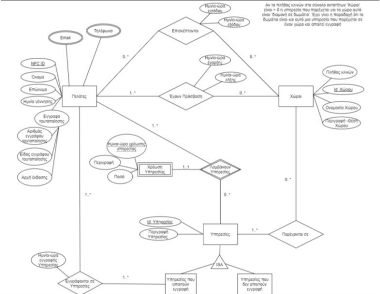
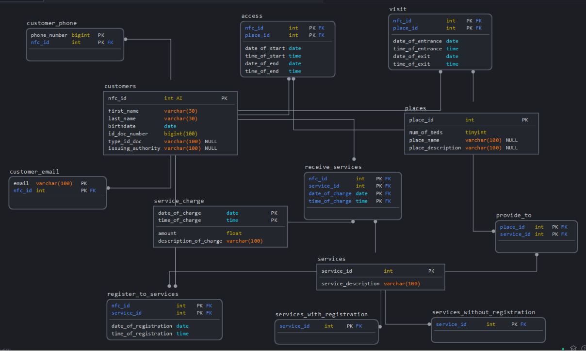

# Repository for project in Databases course at ECE, NTUA, academic year 2020-2021

## 📜 Description
This repository contains the final project of our team. 
The concept of the project can be read below:

A large hotel unit, ASDF Palace, provides hospitality services
managed rooms and restaurants, bars, gyms, meeting rooms, etc.
The company is already taking successful steps in its digital transformation of
its services. Under the threat of the COVID-19 pandemic, the company implements all
protocols for the safety of staff and visitors and at the same time the
management wishes to take additional measures to minimize risks and
effects on the health of employees and visitors. Additionally, the company takes 
drastic measures in case a customer is diagnosed with COVID-19.

The goal is to minimize customer contact with switches,
handles, door and lifts in communal areas. In addition, no transactions (with credit
or cash) will be carried out for the use of the hotel services. In case someone from
the guest is found to be positive, immediately his / her movements and contacts 
will be traced, in order to deal with the most probable transmittions of the virus. 

More details can be found in 'project_2021_final.pdf'.

## 📈 Database Diagrams
### ER Model

### Relational Model

## 🛠 Tools

Server:
* XAMPP
* Apache
* MySQL

Data generation:
* Python (connected to the database)
* Excel (for csv files)

Other tools:
* phpMyAdmin
* sqldbm

## 🖥 Installation Steps
  1. Set up XAMPP server
  2. Enter phpMyAdmin
  3. Run SQL code
  4. Import data from csv files
  5. Execute python code to get all data
  6. Open php files on browser

## Authors

| Name | Email |
| --- | --- |
| Dimitrios Kalemis | ... |
| Mihalis Kolliniatis | ... |

